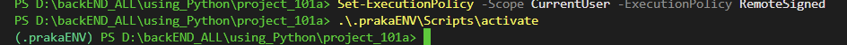

## backEnd Beginning


delete effect observation 

```python 
python -m venv <env_name>

<env_name> \Scripts\activate

deactivate

rmdir /s /q <env_name>

/s - subdirectories
It tells the command to delete all files and subdirectories within the specified directory. Without this, the command will only delete the directory if it's empty.
/q - quite mode (no promts)
```

| Step                      | 🪟 Windows (PowerShell / CMD) | 🐧 Linux (Ubuntu / Amazon Linux) | WHY difference?                             |
| ------------------------- | ----------------------------- | -------------------------------- | ------------------------------------------- |
| Check Python              | `python --version`            | `python3 --version`              | Linux me multiple python versions hote hain |
| Check venv module         | `python -m venv --help`       | `python3 -m venv --help`         | Same concept, different binary name         |
| Install venv (if missing) | Mostly preinstalled           | `sudo apt install python3-venv`  | Linux minimal installs hota hai             |
| Create venv               | `python -m venv venv`         | `python3 -m venv venv`           | Same command                                |
| Folder created            | `venv\Scripts\`               | `venv/bin/`                      | OS structure difference                     |
| Activate                  | `.\venv\Scripts\Activate`     | `source venv/bin/activate`       | Shell mechanism different                   |
| Prompt change             | `(venv) PS C:\project>`       | `(venv) user@machine:~/project$` | Visual confirmation                         |
| Check active python       | `where python`                | `which python`                   | Windows vs Unix command                     |
| Deactivate                | `deactivate`                  | `deactivate`                     | Same everywhere                             |


```bash
PS D:\backEND_ALL\using_Python\project_101a> .\.prakaENV\Scripts\activate

.\.prakaENV\Scripts\activate : File D:\backEND_ALL\using_Python\project_101a\.prakaENV\Scripts\Activate.ps1 cannot be loaded because running        
scripts is disabled on this system. For more information, see about_Execution_Policies at https:/go.microsoft.com/fwlink/?LinkID=135170.
At line:1 char:1
+ .\.prakaENV\Scripts\activate
+ ~~~~~~~~~~~~~~~~~~~~~~~~~~~~
    + CategoryInfo          : SecurityError: (:) [], PSSecurityException
    + FullyQualifiedErrorId : UnauthorizedAccess

Get-ExecutionPolicy
Restricted
PS D:\backEND_ALL\using_Python\project_101a>


```



