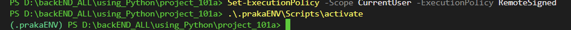

## backEnd Beginning


delete effect observation 

```python 
python -m venv <env_name>

<env_name> \Scripts\activate

deactivate

rmdir /s /q <env_name>

/s - subdirectories
It tells the command to delete all files and subdirectories within the specified directory. Without this, the command will only delete the directory if it's empty.
/q - quite mode (no promts)
```

| Step                      | 🪟 Windows (PowerShell / CMD) | 🐧 Linux (Ubuntu / Amazon Linux) | WHY difference?                             |
| ------------------------- | ----------------------------- | -------------------------------- | ------------------------------------------- |
| Check Python              | `python --version`            | `python3 --version`              | Linux me multiple python versions hote hain |
| Check venv module         | `python -m venv --help`       | `python3 -m venv --help`         | Same concept, different binary name         |
| Install venv (if missing) | Mostly preinstalled           | `sudo apt install python3-venv`  | Linux minimal installs hota hai             |
| Create venv               | `python -m venv venv`         | `python3 -m venv venv`           | Same command                                |
| Folder created            | `venv\Scripts\`               | `venv/bin/`                      | OS structure difference                     |
| Activate                  | `.\venv\Scripts\Activate`     | `source venv/bin/activate`       | Shell mechanism different                   |
| Prompt change             | `(venv) PS C:\project>`       | `(venv) user@machine:~/project$` | Visual confirmation                         |
| Check active python       | `where python`                | `which python`                   | Windows vs Unix command                     |
| Deactivate                | `deactivate`                  | `deactivate`                     | Same everywhere                             |


```bash
PS D:\backEND_ALL\using_Python\project_101a> .\.prakaENV\Scripts\activate

.\.prakaENV\Scripts\activate : File D:\backEND_ALL\using_Python\project_101a\.prakaENV\Scripts\Activate.ps1 cannot be loaded because running        
scripts is disabled on this system. For more information, see about_Execution_Policies at https:/go.microsoft.com/fwlink/?LinkID=135170.
At line:1 char:1
+ .\.prakaENV\Scripts\activate
+ ~~~~~~~~~~~~~~~~~~~~~~~~~~~~
    + CategoryInfo          : SecurityError: (:) [], PSSecurityException
    + FullyQualifiedErrorId : UnauthorizedAccess

Get-ExecutionPolicy
Restricted
PS D:\backEND_ALL\using_Python\project_101a>


```




## Issue 1

PYTHON ERROR: Non-UTF-8 code starting with '\xff' (PowerShell Issue)

PROBLEM:
When running a Python file, error appears:

SyntaxError: Non-UTF-8 code starting with '\xff'

CAUSE:
File was created using PowerShell command:

echo "" > test.py

PowerShell '>' redirect saves files in UTF-16 LE encoding by default.
Python 3 expects source files in UTF-8 encoding.
UTF-16 files start with bytes FF FE (\xff), causing the error.

WHY test2.py WORKED:
File created using:

ni test2.py

This creates a normal empty file (UTF-8 compatible), so Python runs it.

SOLUTIONS:

1. BEST — Create Python file properly in PowerShell:

ni script.py

### or

New-Item script.py

2. Create file with UTF-8 encoding explicitly:

Set-Content script.py "" -Encoding utf8

3. Fix an existing broken file:

Get-Content test.py | Set-Content test.py -Encoding utf8

4. In VS Code:
   Bottom-right → Click Encoding → Save with Encoding → UTF-8

RULE TO REMEMBER:

PowerShell:

> redirect  → UTF-16 ❌ (causes Python error)

ni command → UTF-8 / empty ✅ (safe)

SUMMARY:
Never use `echo "" > file.py` in PowerShell for Python files.
Use `ni file.py` or save as UTF-8 instead.


## Issue 2

# 📌 .gitignore Pattern Matching — Clear Mental Model

## 🧠 Core Rule

Git matches .gitignore patterns against the FULL RELATIVE PATH from the repository root.

It does NOT match from:
- Your system root
- VSCode view
- Random folder view

To check repo root:
git rev-parse --show-toplevel


------------------------------------------------------------

## 1️⃣ Folder Name Only Pattern

venv/

Meaning:
Ignore ANY folder named "venv" anywhere in the repo.

Matches:
repo/venv/
repo/app/venv/
repo/x/y/venv/

Why?
Because there is NO leading slash.
Git matches the folder name anywhere in the path.


------------------------------------------------------------

## 2️⃣ Path-Based Pattern

project_103/testignore/

Meaning:
Ignore folder "testignore"
Inside folder "project_103"
At any depth.

Matches:
repo/project_103/testignore/
repo/app/project_103/testignore/

Does NOT match:
repo/using_Python/project_103/testignore/

Why?
Because Git compares the full relative path.
Actual path:
using_Python/project_103/testignore/
Pattern:
project_103/testignore/

They are not the same structure → no match.


------------------------------------------------------------

## 3️⃣ Leading Slash "/"

 /project_103/testignore/

Meaning:
Match ONLY from repository root.

Matches:
repo/project_103/testignore/

Does NOT match:
repo/app/project_103/testignore/

Leading "/" locks the pattern to repo root.


------------------------------------------------------------

## 4️⃣ Trailing Slash "/"

testignore/

Means:
Match directory only.
Will NOT match a file named "testignore".


------------------------------------------------------------

## 🔥 Why "venv/" Worked But Path Didn't?

venv/  → matches folder name anywhere.
project_103/testignore/ → must match exact path structure.

If the actual full path does not match → Git will not ignore it.


------------------------------------------------------------

## 🧠 Industry Thinking Rule

Before writing a .gitignore rule, always ask:

"What is the exact relative path from repo root?"

Then write pattern accordingly.


------------------------------------------------------------

## 🏆 Final Takeaways

✔ Git matches FULL relative path from repo root  
✔ No leading "/" → match anywhere  
✔ Leading "/" → match from root only  
✔ Trailing "/" → directory only  
✔ Name-only pattern (like venv/) works globally  

Think in paths. Not guesses.


# Flask Routes 

```
================= FLASK ROUTE + METHOD BEHAVIOR =================

1️⃣ BASIC ROUTE

@app.route('/login', methods=['GET','POST'])
def login():
    if request.method == 'POST':
        return "Process Login"
    return "Show Login Page"


---------------------------------------------------------------

2️⃣ FLASK INTERNAL FLOW

Incoming Request
        |
        v
Match URL?
        |
        v
Check Method Allowed?
        |
   YES ---------------> Call Function
   NO  ----------------> Return 405 (Method Not Allowed)


---------------------------------------------------------------

3️⃣ IMPORTANT RULES

✔ methods=['GET','POST']
   → Only these methods allowed

✔ If request method NOT in list
   → Function WILL NOT RUN
   → Flask automatically returns 405

✔ Inside function:
   → request.method decides behavior


---------------------------------------------------------------

4️⃣ WHAT HAPPENS IN DIFFERENT CASES

Case A:
GET request
→ Function runs
→ POST condition false
→ "Show Login Page"

Case B:
POST request
→ Function runs
→ POST condition true
→ "Process Login"

Case C:
DELETE request (NOT in methods list)
→ Function DOES NOT RUN
→ Flask returns 405 error


---------------------------------------------------------------

5️⃣ CLEAN BEGINNER PATTERN

@app.route('/login', methods=['GET','POST'])
def login():

    if request.method == 'GET':
        return "Show Login Page"

    elif request.method == 'POST':
        return "Process Login"


---------------------------------------------------------------

🧠 CORE MENTAL MODEL

Flask filters METHOD first.
Your function handles LOGIC second.

(URL + Method allowed?) → THEN function executes.

===============================================================
```


==================== PYTHON IMPORT + FLASK ====================

Flask = ek module (toolbox)

Toolbox ke andar:
  - Flask (class)
  - request (object)
  - jsonify
  - render_template
  - etc.

---------------------------------------------------------------

1) import flask

-> Pure toolbox ko laate ho
-> Use karne ka tareeka:

   flask.Flask
   flask.request
   flask.jsonify

---------------------------------------------------------------

2) from flask import Flask, request

-> Sirf specific tools ko directly laate ho
-> Use karne ka tareeka:

   Flask
   request

(no flask. prefix needed)

---------------------------------------------------------------

IMPORTANT:

Import karna = access lena
Import karna ≠ object banana

request object har HTTP call pe Flask khud banata hai.

Tum import sirf reference laa rahe ho.

---------------------------------------------------------------

Mental Model:

Browser → HTTP request
         ↓
Flask creates request object
         ↓
Tum usko access karte ho (via import)

===============================================================