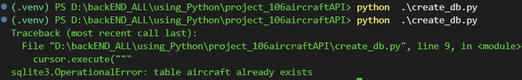

Phase1
```
AircraftAPI/

│
├── venv/
│
├── data/
│      aircraft.json
│
├── app.py
│
└── aircraft.db   ← Today

aircraft.db
│
├── aircraft
├── countries
├── operators
└── performance

```

- no need for pip install sqlite3 , its actually inside flask 
- 

```
connection = sqlite3.connect("aircraft.db")


Python
   |
   |
==================
Communication Pipe
==================
   |
   |
Sqlite3
```




- AUTOINCREMNT 

